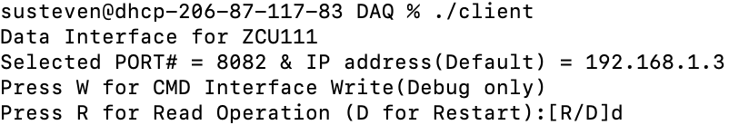

# UltraFast Failure Test Unit

This repo contains front-end software for Xilinx rftool developed for Xilinx ZCU111. Developed by UBC Capstone group CG-045.

`./DAQ/CMD_Interface.c` is the Command-line Server where ADC and PLL clock can be set.

`./DAQ/Data_Interface.c` is the Data Server for receiving ADC Data and converting them to .csv file.

## Windows User:

Use Microsoft Visual Studio to compile the .c code as a terminal app.

## Linux/Mac User:

Use GCC to compile the c code

`gcc CMD_Interface.c/Data_Interface.c -o pick_a_name`

## Set IP Address

Connect the Ethernet cable to your computer. And in the IP setting page, set IPv4 address and mask to:

`192.168.1.2`

`255.255.255.0`

## Initialization Guide

### Connect Data Server

After the board is booted, connect the Data Server first (Data_Interface.c)
shown like the image below.

### Connect CMD Server
Then run the CMD Server(CMD_Interface.c). 

### Disconnect and Reconnect Data Server
After the cmd server shows `Restart Data server`

enter `D` on the data server-side to restart the interface.

And then press `enter` on the CMD server to continue initialization. 

The CMD interface will then run the rest initialization process, as shown in the figure below.

## Data Acquisition

### TCP Command interface

Now the CMD interface is letting users choose one of the preset sampling rates. Press `ABCD` then `enter` to choose the sampling rate.

After `System Ready` shows up, connect the DUT signal to the ADC port(ADC T0 CH0).

When the signal is ready, hit `enter` to start sampling data.

After `Data Ready` Shows up, move to the Data interface.

### Data Interface

Press `r` to read data from the board. The interface will then ask you the sampling rate. Make sure to enter the same rate as the previous step.

The data server will now pass the data to the computer and save it as .csv file.

## Python GUI

After .csv file is saved, run python GUI code at `./GUI/main.py`. Upload the .csv file and then click plot.

## rfdc0476 official documentation (Commands for Future development)

https://www.xilinx.com/support/documentation-navigation/design-hubs/dh0037-zynq-ultrascale-plus-rfsoc-hub.html
